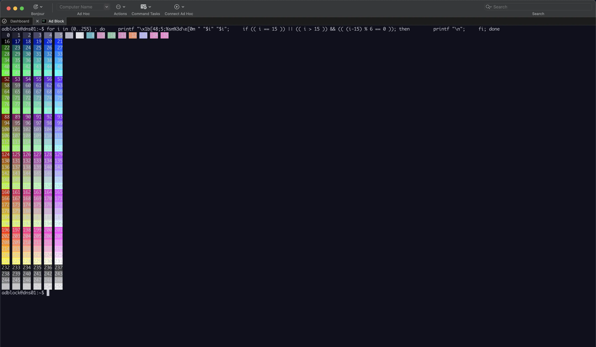

<h3 align="center">
	
	Miami for <a href="https://www.royalapps.com/ts/win/features">Royal TS</a>
	
</h3>

	
	
	

	

## Usage

1. Right click an SSH connection > Properties > Colors

2. Click on Palette > Manage > Import

3. Import the royalts-miami.rtcp file from this repo and press OK.